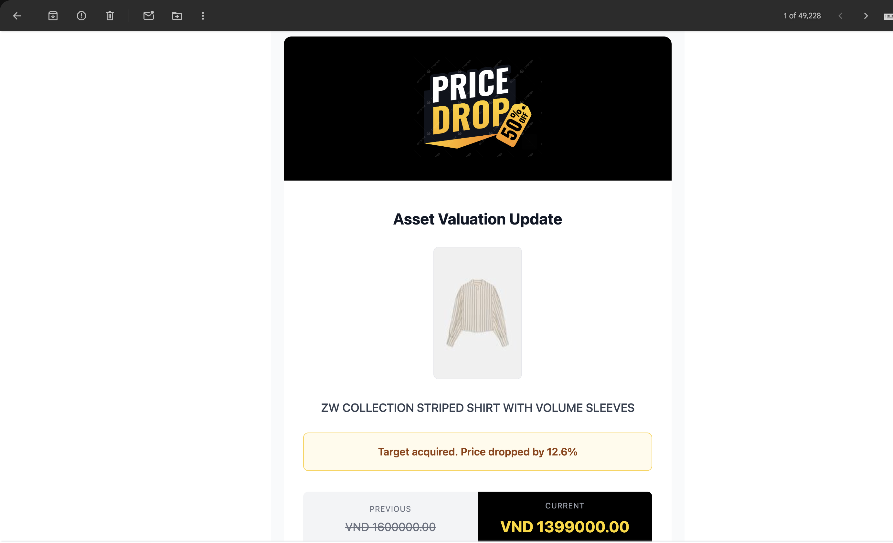

# Price Drop - Intelligent Price Tracking

**Price Drop** is a premium, high-performance price tracking application designed for the strategic shopper. It monitors product prices across major e-commerce platforms in real-time and delivers instant email alerts when prices drop, ensuring you never miss a deal ("asset") again.

<div align="center">
  
</div>

## Core Features

-   **Real-Time Tracking:** Monitors product URLs and updates prices instantly relying on automated cron jobs.
-   **Smart Alerts:** Sends beautifully designed email notifications when a target price is reached.
-   **Price History:** Visualizes price trends over time with interactive Gold-themed charts.
-   **Premium UI:** Features a sophisticated "White & Gold" aesthetic with dark mode support.
-   **Asset Management:** Add, track, and remove products with a simple, dashboard-style interface.

## Tech Stack

-   **Framework:** [Next.js 14](https://nextjs.org/) (App Router)
-   **Database & Auth:** [Supabase](https://supabase.com/)
-   **Styling:** [Tailwind CSS](https://tailwindcss.com/) & [Shadcn UI](https://ui.shadcn.com/)
-   **Charts:** [Recharts](https://recharts.org/)
-   **Emails:** [Resend](https://resend.com/)

## Getting Started

First, install the dependencies:

```bash
npm install
# or
yarn install
```

Then, run the development server:

```bash
npm run dev
# or
yarn dev
```

Open [THIS DEMO](https://asset-price-drop.vercel.app) to experience the application.

## Email Notifications

The application uses a custom, modern email template for price drop alerts, ensuring a premium experience even in your inbox.



---

**Master the Price. Seize the Deal.**
